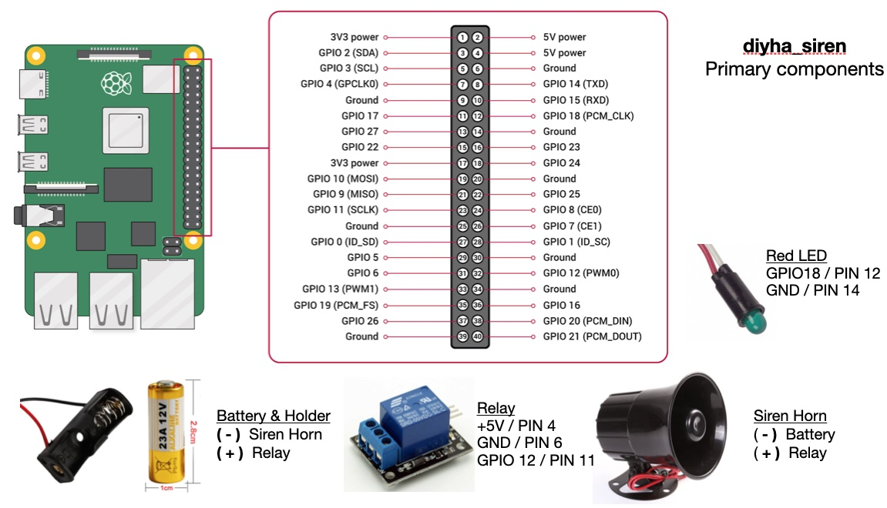

# siren
Do It Yourself Home Automation emergency alarm activated by Alexa.

## Description: 
This is my latest Raspberry Pi project that implements a loud, pulsing siren and a flashing red armed activity LED as part of a larger "do it yourself home automation" system.  The application requires **Raspbian OS** and is written in **python3**. The siren is controlled by a relay and powered by a single 12 volt battery. I usually create a **systemd service** so the application runs at boot.



## Installation: 
Installation is a two step process. First make the bash scripts executable and  import two **pip3 libraries**. MQTT is used to subscribe and publish "do it yourself home automation" topics. The application uses two of Raspberry Pi pins. The second step is to decide whether to manually run the application from the command line or use a systemd service at boot.

- Make bash scripts executable
```
chmod +x *.sh
```

- Install MQTT and RPI.GPIO libraries
```chmod +x *.sh
./installation_script.sh
```

## Usage: 
You need to decide whether you want to manually run the application or have it started as part of the boot process. I recommend making a **Raspbian OS systemd service**, so the application starts when rebooted or controled by **systemctl** commands. The **systemd_script.sh** creates a diyha_siren directory in **/usr/local directory**. The application files are then copied to this new directory. The application will also require a log file in **/var/log directory** called diyha_siren.log

The application subscribes to four MQTT topics. 

- First **diy/system/fire** activates a sustained and very loud siren.
- The **diy/system/panic** starts the same siren but pulses on an off every few seconds to differnciate from the fire alarm. 
- Another topic **diy/system/who** causes the application to publish its status to the MQTT broker. 
- The fourth topic is **diy/system/test** which is used for developement testing.

diyha_siren also publishes several processor messages every 15 minutes.
- **diy/hostname/cpu** was the average CPU utilization
- **diy/hostname/celsius** was the average CPU temperature
- **diy/hostname/disk** was the average free disk space

Lastly the application posts it operating system version and Raspberry Pi model
- **diy/hostname/os** is the version of the Raspbian operating system
- **diy/hostname/pi** is the Pi model and version

The application uses two of the Raspberry Pi pins: **GPIO 17** for the siren and **GPIO 18** for a green LED indicating that the device is running (easily changed).

To manually run the application enter the following command (sudo may be required on your system)
```
sudo python3 diyha_siren.py --mq <MQTT_broker_hostname_or_IP_addrss> --loc <Location_topic>
```
- <MQTT_broker_hostname_or_IP_addrss> I use the Open Source Mosquitto broker and bridge
- <Location_topic> is the MQTT topic used to identify the location of the IOT device 

Create the diyha-siren systemd service (the script uses a file name argument to create the service)
```
./systemd_script.sh diyha_siren
```

This script also adds four aliases to the **.bash_aliases** in your home directory for convenience.
```
sudo systemctl start diyha_siren
sudo systemctl stop diyha_siren
sudo systemctl restart diyha_siren
sudo systemctl -l status diyha_siren
```

## Contributing: 

Adafruit supplies most of my hardware. http://www.adafruit.com

My "do it yourself home automation" system leverages the work from the Eclipse IOT Paho project. https://www.eclipse.org/paho/

I use the PyCharm development environment https://www.jetbrains.com/pycharm/

## Credits: 
Developed by parttimehacker.

## License: 
MIT
